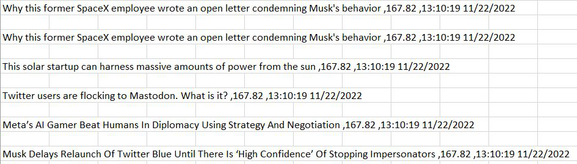

> <u>**P2**</u>

# Purpose

## Background


### High-Frequency trading 

High-Frequency trading or HFT firms make millions of stock trades per second making very little in marginal profits. These small profits become massive taking into consideration that 
there are millions of these trades happening at once. Using many forms of statistical arbitrage in the market, these firms can buy commodities in one market at a cheaper price and sell them in another at a higher price. The key to finding these opportunities is honing in on key indicators that can help a trader predict the direction of the commodity. In the financial market there are many things that can impact a stocks price. For example, fluctuating interest rates, worldwide conflicts, other markets, cryptocurrency and the how we interact with our world all impact each other at the end of the day.

### Breaking News Headlines Manipulating Stock Prices

In the age of technology when a spicy news headline hits the big financial news networks, more eyes are consuming this content than our own. Deep in the basements of wall street, there are high-speed trading firms with algorithms that not only keep track of the buzz but are making split-second decisions based on these headlines at every moment in time. The question, however, is are these headlines and subsequent trades actually impact the stock market as we know it. Using a rudimentary web scraper to collect breaking news headlines in the financial world, I will attempt to prove that there is a relationship between headlines and stock prices. I will be looking at a popular company that frequents social media and the internet, Elon Musk's Tesla company otherwise known as TSLA on the New York stock exchange(NYSE). 


# Data Acquisition

Tesla, aka Tesla (TSLA) on the NASDAQ, is an American multinational automotive and clean energy company headquartered in Austin, Texas. The company designs and manufactures electric vehicles, battery energy storage from home to grid-scale, solar panels and solar roof tiles, and related products and services. Due to the eccentric CEO Elon Musk TSLA reliably frequents sensational news headlines throughout the web. This makes the stock quite volatile as the price fluctuates rapidly. In order to capture these headlines I have written the python script below that captures headline data using *Microsoft Visual Studio*.


## News_Bot2.0 Headline Crawler
\scriptsize
```{python, eval=FALSE,warning = FALSE, message = FALSE,error=FALSE}
import requests
import urllib.request
import time
import re
from bs4 import BeautifulSoup
from datetime import datetime
from selenium import webdriver
from pynput.keyboard import Key, Controller
from csv import writer


def scrape_logger():
    #CNN (Static website)
    def cnn():
        #print("Scanning CNN website...")
        cnn_URL = 'https://www.cnn.com/business'
        cnn_page = requests.get(cnn_URL)
        cnn_raw_code = cnn_page.content
        cnn_source = BeautifulSoup(cnn_raw_code, "html.parser")
        global cnn_headlines
        cnn_headlines = cnn_source.find_all('span', class_='cd__headline-text') 
        #print("Scan complete.")
        return cnn_headlines
    #Forbes (Static website)
    def forbes():
        #print("Scanning Forbes website...")
        forbes_URL = 'https://www.forbes.com/'
        forbes_page = requests.get(forbes_URL)
        forbes_raw_code = forbes_page.content
        forbes_source = BeautifulSoup(forbes_raw_code, "html.parser")
        global forbes_headlines
        forbes_headlines = forbes_source.find_all('a', class_="happening__title")
        #print("Scan complete.")
        return forbes_headlines
    #Bloomberg (Dynamic website)
    def bloomberg():
        #print("Scanning Bloomberg website...")
        bloomberg_URL = 'https://www.bloomberg.com/markets/watchlist'
        bloomberg_page = webdriver.Firefox()
        bloomberg_page.get(bloomberg_URL)
        time.sleep(5) # wait 5 seconds for the page to load the js
        bloomberg_raw_code = bloomberg_page.execute_script("return document.documentElement.outerHTML")
        type = Controller()
        type.press(Key.alt)
        type.press(Key.space)
        type.press('c')
        type.release(Key.alt)
        type.release(Key.space)
        type.release('c') 
        #time.sleep(5)
        bloomberg_source = BeautifulSoup(bloomberg_raw_code, "html.parser")
        global bloomberg_headlines
        bloomberg_headlines = bloomberg_source.find_all('a', class_="headline__55bd5397")    
        #print("Scan complete.")
        if bloomberg_headlines == ():
            print("ERROR: \n")
            print("Website html has changed, please update code")
        return bloomberg_headlines
    #MarketWatch (Dynamic website)
    def marketwatch():
        #print("Scanning MarketWatch website...")
        MW_URL = 'https://www.marketwatch.com/'
        MW_page = requests.get(MW_URL)
        MW_raw_code = MW_page.content
        MW_source = BeautifulSoup(MW_raw_code, "html.parser")
        global MW_headlines
        MW_headlines = MW_source.find_all('span', class_='headline')
        #print("Scan complete.")
        return MW_headlines
    #WallStreetJournal (Static website)
    def wall_street_journal():
        #print("Scanning Wall Street Journal website...")
        WSJ_URL = 'https://www.wsj.com/news/latest-headlines'
        WSJ_page = webdriver.Firefox()
        WSJ_page.get(WSJ_URL)
        time.sleep(5)
        WSJ_raw_code = WSJ_page.execute_script("return document.documentElement.outerHTML")
        type2 = Controller()
        type2.press(Key.alt)
        type2.press(Key.space)
        type2.press('c')
        type2.release(Key.alt)
        type2.release(Key.space)
        type2.release('c')
        #time.sleep(5)
        WSJ_source = BeautifulSoup(WSJ_raw_code, "html.parser")
        global WSJ_headlines
        WSJ_headlines = WSJ_source.find_all('div', class_='WSJTheme--headline--7VCzo7Ay')
        #print("Scan complete.")
        if WSJ_headlines == ():
            print("ERROR: \n")
            print("Website html has changed, please update code")
        return WSJ_headlines

    def tsla():
        #print("Scanning tsla stock price...")
        tsla_URL = 'https://www.cnbc.com/quotes/TSLA'
        tsla_page = requests.get(tsla_URL)
        tsla_raw_code = tsla_page.content
        tsla_source = BeautifulSoup(tsla_raw_code, "html.parser")
        global tsla_price
        tsla_price = tsla_source.find('span', class_='QuoteStrip-lastPrice') 
        #print("Scan complete.")
        #print(tsla_price.text)
        return tsla_price

    def scanning():
        cnn()
        forbes()
        bloomberg()
        marketwatch()
        wall_street_journal()
        tsla()

    global stock_list1
    stock_list1 = []
    stock_list1.append("Tesla")
    stock_list1.append("Elon")
    stock_list1.append("Musk")
    stock_list1.append("Space")
    stock_list1.append("SpaceX")
    stock_list1.append("Electric")
    stock_list1.append("Technology")
    stock_list1.append("Battery")
    stock_list1.append("Batteries")
    stock_list1.append("Twitter")
    stock_list1.append("Powered")
    stock_list1.append("Model Y")
    stock_list1.append("Model S")
    stock_list1.append("Star Link")
    stock_list1.append("Model 3")
    stock_list1.append("Model X")
    stock_list1.append("openai")
    stock_list1.append("AI")
    stock_list1.append("Science")
    stock_list1.append("Technology")
    stock_list1.append("Falcon")
    stock_list1.append("Moon")
    stock_list1.append("Rocket")
    stock_list1.append("Nasa")
    stock_list1.append("Engine")
    stock_list1.append("hyperloop")
    stock_list1.append("jet")
    stock_list1.append("physics")
    stock_list1.append("solar")
    stock_list1.append("solar city")
    stock_list1.append("solar panel")
    stock_list1.append("photocell")

    scanning()

    list_of_headlines = []

    def display_headlines():
        now = datetime.now()
        global date_time
        date_time = now.strftime("%H:%M:%S %m/%d/%Y")
        for cnn_headline in cnn_headlines:
            for stonk in stock_list1:
                if stonk in cnn_headline.text:
                    #make a list to add the headlines, so that I can print them or add them to the csv
                    list_of_headlines.append(cnn_headline.text.replace(",","")+" "+","+tsla_price.text+" "+","+date_time)
                    #print(cnn_headline.text)
        for forbes_headline in forbes_headlines:
            for stonk2 in stock_list1: 
                if stonk2 in forbes_headline.text:
                    list_of_headlines.append(forbes_headline.text.replace(",","")+" "+","+tsla_price.text+" "+","+date_time)
                    #print(forbes_headline.text)
        for bloomberg_headline in bloomberg_headlines:
            for stonk3 in stock_list1: 
                if stonk3 in bloomberg_headline.text:
                    list_of_headlines.append(bloomberg_headline.text.replace(",","")+" "+","+tsla_price.text+" "+","+date_time)
                    #print(bloomberg_headline.text)
        for MW_headline in MW_headlines:
            for stonk4 in stock_list1: 
                if stonk4 in MW_headline.text:
                    list_of_headlines.append(forbes_headline.text.replace(",","")+" "+","+tsla_price.text+" "+","+date_time)
                    #print(forbes_headline.text)
        for WSJ_headline in WSJ_headlines:
            for stonk5 in stock_list1: 
                if stonk5 in WSJ_headline.text:
                    list_of_headlines.append(WSJ_headline.text.replace(",","")+" "+","+tsla_price.text+" "+","+date_time)
                    #print(WSJ_headline.text)
    display_headlines()
    with open('headline_logs.csv', 'a') as f_object:
        writer_object = writer(f_object)
        for i in list_of_headlines[0:]:
            writer_object.writerow([i])
        f_object.close()


scrape_logger()
print("done1")
#time.sleep(240)

```
\normalsize
### How the Crawler Works

Using `BeautifulSoup` to parse the HTML, 5 websites are crawled for their breaking news headlines, pulling every headline and saving them momentarily. The headlines are then sorted for each website, keeping only those headlines that contain words in our TSLA stock related word list named: `stock_list1`. The crawler then pulls current stock market data for TSLA and appends that price alongside a time stamp into a row inside a comma delimited `.csv` excel file named headline_logs. This collection makes up the raw data that was crawled from the websites.


### Scanned Websites

The Headline crawler scans the following websites for headlines related to the TSLA company:

1. [CNN Business](https://www.cnn.com/business)
2. [Forbes](https://www.forbes.com/)
3. [Bloomberg Market Watchlist](https://www.bloomberg.com/markets/watchlist)
4. [Market Watch](https://www.marketwatch.com/)
5. [Wall Street Journal](https://www.wsj.com/news/latest-headlines)

For the current stock price at the time of the headline, the headline crawler scans [CNBC](https://www.cnbc.com/quotes/TSLA) for the market quote on a TSLA share.

## Data Import

<br>


```{r setup, warning = FALSE, message = FALSE, include = FALSE}

knitr::opts_chunk$set(echo = TRUE)
require("knitr")

opts_knit$set(root.dir = "C:/Users/William Roche/Downloads/School/MSDA/13 STAT 6382/Projects/Newsbot_2/Newsbot-2.0/NewsBot 2.0")

#C:\Users\William Roche\Downloads\School\MSDA\13 STAT 6382\P2\Data\COVID-19-master\COVID-19-master\csse_covid_19_data\csse_covid_19_daily_reports_us

# Setting working directory for the project

library(png)
library(broom)
library(tidyverse)
library(car)
library(olsrr)
library(MPV)
library(cvTools)
library(mctest)
library(dplyr)
library(stringr)
library(ggplot2)
library(lubridate)
library(scales)
library(corrplot)
# Loading all necessary libraries


```


<br>

# Libraries

The following libraries were used in the analysis:

*dplyr, broom, tidyverse, olsrr, MPV, car, cvTools, scales, ggplot2, corrplot, stringr, lubridate, & mctest*

```{r, include = FALSE, warning = FALSE, message = FALSE}

# Installing packages required
library(png)
library(ggplot2)
library(broom)
library(tidyverse)
library(olsrr)
library(MPV)
library(car)
library(cvTools)
library(mctest)
library(dplyr)
library(stringr)
library(lubridate)
library(scales)
library(corrplot)
```

The data includes any news related to Tesla or its subsidiaries, which includes but is not limited to space exploration, SpaceX, battery technology advancements, Elon Musk, Twitter and a lot more keywords logged in our word list. The raw data consists of a single row containing 3 observations, a headline, the time stamp and the stock price at the current time. These cells are then separated by an empty buffer cell (Fig. 1).



# Data Wrangling

## Cleaning data

Within Excel, the data is then cleaned starting by deleting all empty row buffer spaces between headlines. The single cells are then separated by commas into three columns. The columns are then names as follows; Headline, Price, Date. Using Excel, a fourth column is created named `Stock Direction` which indicates whether the stock price has increased, decreased or remained the same, denoted by -1, 0, and 1. Before importing the data into r studio one final step is to remove any duplicate rows of data. In some instances as the headline crawler is scanning headlines, the headlines themselves do not change and so this results in multple rows of the same data. Therefore we delete the duplicates and move on to creating a workable dataframe.


```{r, include = FALSE, warning = FALSE, message = FALSE}
# Loading Data + Cleaning
data <- read.csv("headline_logs1 - Copy.csv")
#This step was done to each dataset for the timeframe, but is hidden in order to conserve space
```


After importing the excel file into r studio, we define our dataframe.
\scriptsize
```{r, include = TRUE, warning = FALSE, message = FALSE}
head(data)
```
\normalsize
## Additional Data

### Positive and Negative Wordlists

We create two lists of words, `positive_words` and `negative_words` in order to see if they are contained within the headlines. Within the two lists there are a total of 266 positive words and 254 negative words to pick from when reading each headline.
\scriptsize
```{r, include = TRUE, warning = FALSE, message = FALSE}
positive_words <- 
  c("absolutely" , "accepted" , "acclaimed" , "accomplish" , "accomplishment" , "achievement" , "action" , "active" , "admire" ,
    "adorable" , "adventure" , "affirmative" , "affluent" , "agree" , "agreeable" , "amazing" , "angelic" , "appealing" ,
    "approve" , "aptitude" , "attractive" , "awesome" , "beaming" , "beautiful" , "believe" , "beneficial" , "bliss" ,
    "bountiful" , "bounty" , "brave" , "bravo" , "brilliant" , "bubbly" , "calm" , "celebrated" , "certain" , "champ" ,
    "champion" , "charming" , "cheery" , "choice" , "classic" , "classical" , "clean" , "commend" , "composed" ,
    "congratulation" , "constant" , "cool" , "courageous" , "creative" , "cute" , "dazzling" , "delight" , "delightful" ,
    "distinguished" , "divine" , "earnest" , "easy" , "ecstatic" , "effective" , "effervescent" , "efficient" , "effortless" ,
    "electrifying" , "elegant" , "enchanting" , "encouraging" , "endorsed" , "energetic" , "energized" , "engaging" , 
    "enthusiastic" , "essential" , "esteemed" , "ethical" , "excellent" , "exciting" , "exquisite" , "fabulous" , "fair" , 
    "familiar" , "famous" , "fantastic" , "favorable" , "fetching" , "fine" , "fitting" , "flourishing" , "fortunate" , "free" ,
    "fresh" , "friendly" , "fun" , "funny" , "generous" , "genius" , "genuine" , "giving" , "glamorous" , "glowing" , "good" ,
    "gorgeous" , "graceful" , "great" , "green" , "grin" , "growing" , "handsome" , "happy" , "harmonious" , "healing" , "healthy" ,
    "hearty" , "heavenly" , "honest" , "honorable" , "honored" , "hug" , "idea" , "ideal" , "imaginative" , "imagine" , 
    "impressive" , "independent" , "innovate" , "innovative" , "instant" , "instantaneous" , "instinctive" , "intellectual" , 
    "intelligent" , "intuitive" , "inventive" , "jovial" , "joy" , "jubilant" , "keen" , "kind" , "knowing" , "knowledgeable" , 
    "laugh" , "learned" , "legendary" , "light" , "lively" ,  "lovely" , "lucid" , "lucky" , "luminous" , "marvelous" , "masterful" ,
    "meaningful" , "merit" , "meritorious" , "miraculous" , "motivating" , "moving" , "natural" , "nice" , "novel" , "now" , 
    "nurturing" , "nutritious" , "okay" , "one" , "one-hundred percent" , "open" , "optimistic" , "paradise" , "perfect" , 
    "phenomenal" , "pleasant" , "pleasurable" , "plentiful" , "poised" , "polished" , "popular" , "positive" , "powerful" , 
    "prepared" , "pretty" , "principled" , "productive" , "progress" , "prominent" , "protected" , "proud" , "quality" , "quick" ,
    "quiet" , "ready" , "reassuring" , "refined" , "refreshing" , "rejoice" , "reliable" , "remarkable" , "resounding" , "respected" ,
    "restored" , "reward" , "rewarding" , "right" , "robust" , "safe" , "satisfactory" , "secure" , "seemly" , "simple" , "skilled" ,
    "skillful" , "smile" , "soulful" , "sparkling" , "special" , "spirited" , "spiritual" , "stirring" , "stunning" , "stupendous" ,
    "success" , "successful" , "sunny" , "super" , "superb" , "supporting" , "surprising" , "terrific" , "thorough" , "thrilling" ,
    "thriving" , "tops" , "tranquil" , "transformative" , "transforming" , "trusting" , "truthful" , "unreal" , "unwavering" , "up" ,
    "upright" , "upstanding" , "valued" , "vibrant" , "victorious" , "victory" , "vigorous" , "virtuous" , "vital" , "vivacious" ,
    "wealthy" , "welcome" , "well" , "whole" , "wholesome" , "willing" , "wonderful" , "wondrous" , "worthy" , "wow" , "yes" ,
    "yummy" , "zeal" , "zealous")


negative_words <- 
  c("abysmal" , "adverse" , "alarming" , "angry" , "annoy" , "anxious" , "apathy" , "appalling" , "atrocious" , "attorney" ,
    "awful" , "bad" , "banal" , "barbed" , "belligerent" , "bemoan" , "beneath" , "blocked" , "blow" , "blew" , "boring" ,
    "broken" , "callous" , "can't" , "case" , "clumsy" , "coarse" , "cold" , "cold-hearted" , "collapse" , "confused" ,
    "concerns", "contradictory" , "contrary" , "corrosive" , "corrupt" , "crazy" , "crash" , "creepy" , "criminal" , "cruel" ,
    "cry" , "cutting" , "damage" , "damaging" , "dastardly" , "dead" , "decaying" , "deformed" , "deny" , "deplorable" ,
    "depressed" , "deprived" , "despicable" , "detrimental" , "dirty" , "disease" , "disgusting" , "disheveled" ,
    "dishonest" , "dishonorable" , "dismal" , "distress" , "don't" , "dreadful" , "dreary" , "enraged" , "eroding" , "evil" ,
    "explode" , "fail" , "fall" , "faulty" , "fear" , "fell" , "feeble" , "fight" , "filthy" , "foul" , "frighten" ,
    "frightful" , "gawky" , "ghastly" , "grave" , "greed" , "grim" , "grimace" , "gross" , "grotesque" , "gruesome" ,
    "guilty" , "haggard" , "hard" , "hard-hearted" , "harmful" , "hate" , "hideous" , "homely" , "horrendous" , "horrible" ,
    "hostile" , "hurthurtful" , "icky" , "ignorant" , "ignore" , "ill" , "immature" , "imperfect" , "impossible" , "inane" ,
    "inelegant" , "infernal" , "injure" , "injurious" , "insane" , "insidious" , "insipid" , "jealous" , "junky" , "lose" ,
    "lousy" , "lumpy" , "malicious" , "mean" , "menacing" , "messy" , "misshapen" , "missing" , "misunderstood" , "moan" ,
    "moldy" , "monstrous" , "naive" , "nasty" , "naughty" , "negate" , "negative" , "never" , "no" , "nobody" , "nondescript" ,
    "nonsense" , "not" , "noxious" , "objectionable" , "odious" , "offensive" , "old" , "oppressive" , "pain" , "perturb" ,
    "pessimistic" , "petty" , "plain" , "poisonous" , "poor" , "prejudice" , "questionable" , "quirky" , "quit" , "reject" ,
    "repellant" , "reptilian" , "repugnant" , "repulsive" , "revenge" , "revolting" , "rocky" , "rotten" , "rude" , "ruthless" ,
    "sad" , "savage" , "scare" , "scary" , "scream" , "severe" , "shocking" , "shoddy" , "sick" , "sickening" , "sinister" ,
    "slimy" , "smelly" , "sobbing" , "sorry" , "spiteful" , "sticky" , "stinky" , "stormy" , "stressful" , "stuck" , "stupid" ,
    "substandard" , "sue" , "suspect" , "suspicious" , "tense" , "terrible" , "terrifying" , "threatening" , "ugly" ,
    "undermine" , "unfair" , "unfavorable" , "unhappy" , "unhealthy" , "unjust" , "unlucky" , "unpleasant" , "unsatisfactory" ,
    "unsightly" , "untoward" , "unwanted" , "unwelcome" , "unwholesome" , "unwieldy" , "unwise" , "upset" , "vice" , "vicious" ,
    "vile" , "villainous" , "vindictive" , "wary" , "weary" , "wicked" , "woeful" , "worthless" , "wound" , "yell" , "yucky" ,
    "zero" , "zilch")
```
\normalsize
## Counting Positive/Negative Word Occurances

Using the `str_count` function we count how many positive and negative words are contained within a headline and record them in a new column.
```{r, include = TRUE, warning = FALSE, message = FALSE}
data$positive_w <-0
data$negative_w <-0


for (i in 1:nrow(data)){
  data$positive_w[i] <- sum(str_count(data$Headline[i], positive_words))
  data$negative_w[i] <- sum(str_count(data$Headline[i], negative_words))
}
```


```{r, warning = FALSE, message = FALSE, include=FALSE}

# Changing `Last_Update` column from character class to date.

#Covid19_data$Date <- as.Date.character(Covid19_data$Last.Update, "%m/%d/%Y")
length(positive_words)
length(negative_words)
```
## Creating `influence` variable

We create the `influence` variable as the difference between the negative and positive word count.
```{r warning = FALSE, message = FALSE}

data$influence <- data$negative_w - data$positive_w

#data$Date <- as.Date.character(data$Date, "%m/%d/%Y")
data$Date_fixed <- 1:nrow(data)
```


<br>

# Data Analysis & Modeling


```{r, message = FALSE, warning = FALSE, echo = FALSE}
str(data)
```

<br>


## Regressors and thier respective coefficients


Intercept = $$e$$

$y$ *[Stock.Direction](Dependent Variable) = Shows whether the stock price increased, decreased or stayed the same based on the previous scanned value. (-1 = stock price decrease, 0 = no change in stock price, 1 = stock price increase)*

$x_1$ *[Positive_w](Independent Variable) = Shows the total count of positive words contained in the TSLA headline.*

$x_2$ *[Negative_w](Independent Variable) = Shows the total count of negative words contained in the TSLA headline.*

$x_3$ *[Influence](Independent Variable) = The positive word count minus the Negative word count, showing overall influence of headline.*

$x_4$ *[Price](Independent Variable) = Shows the current stock price for TSLA stock.*

*[Date](Independent Variable) = Shows the time at which the data was accessed.*


# Visualizing data


## Looking at the Data

<br>

Taking a look at how the data collected shows the price fluctuations in TSLA.
\normalsize
```{r, warning = FALSE, message = FALSE,fig.align = 'right', fig.cap = "Fig. 1",echo=FALSE}

plot(data$Price, main = "TSLA Price Over Time", xlab = "Time", ylab = "Price($)") 

```
<br>

\normalsize

## Distribution of Variables

```{r, warning = FALSE, message = FALSE, fig.cap = "Fig. 2",echo=FALSE}
par(mfrow=c(2,2))
plot(data$Stock.Direction, main="Stock Direction")
plot(data$positive_w, main="Positive Counts")
plot(data$negative_w, main="Negative Counts")
plot(data$influence, main="Influence")
```
## Summary Statistics

```{r warning = FALSE, message = FALSE,echo=FALSE}
#plot(data$Date, data$Price)

data$Date2 <- as.POSIXct(data$Date, format= "%m/%d/%Y %H:%M")
#plot(data$NewDate,data$Price, type = "p")
#date <- as.POSIXct(data$Date, format= "%m/%d/%Y %H:%M") 
#plot(data$Date2,data$Price, type = "p", xlim=as.POSIXct("11/22/2022 00:00:00","12/02/2022 23:59:59"))

data$date22 <- mdy_hms(data$Date,tz=Sys.timezone())

summary(data)
```

```{r warning = FALSE, message = FALSE,fig.cap = "Fig. 3",echo=FALSE}
plot(data$date22,data$Price, type = "p", main ="TSLA Price Distribution", xlab = "Date", ylab = "TSLA Stock Price ($)")
```

## Establishing correlation and directionality of data

The correlation matrix shows high amounts of correlation between positive and negative words as well as influence. This can all be explained due to the fact the they all work together. Both positive and negative words make up the influence. They are also linked to gether as oppoites which can explain the correlation.
```{r warning = FALSE, message = FALSE, fig.cap="Fig. 4",echo=FALSE}
library(corrplot)

data_n <- data %>%
  dplyr::select(Stock.Direction, positive_w, negative_w, influence, Price)
data_cor <- cor(data_n)

corrplot(data_cor)
model_1 <- lm(Stock.Direction~ positive_w+negative_w+influence,data)

model_2 <- lm(Stock.Direction~ influence,data)

model_3 <- lm(Stock.Direction~ Price+influence,data)

```
# Models

## Multiple Regression (MLR) Model

Building a multiple linear regression model, model_1 using positive words, negative words and influence in order to explain stock direction movements.
```{r warning = FALSE, message = FALSE,echo=FALSE}
model_1 <- lm(Stock.Direction~ positive_w+negative_w+influence,data)

summary(model_1)

```


Building a multiple linear regression model, model_3 using price and influence in order to explain stock direction movements.
```{r warning = FALSE, message = FALSE,echo=FALSE}
model_3 <- lm(Stock.Direction~ Price+influence,data)

summary(model_2)

```


## Simple Linear Regression (SLR) Model

Building a simple linear regression model, model_2 using influence in order to explain stock direction movements.
```{r warning = FALSE, message = FALSE,echo=FALSE}
model_2 <- lm(Stock.Direction~ influence,data)

summary(model_2)

```

## Best Model

Using the `ols_step_all_possible` function we derive the best possible model for our data, with the given regressors.
```{r,warning=FALSE, message=FALSE}
all <- lm(Stock.Direction ~positive_w +negative_w +influence +Price,data)

k <- ols_step_all_possible(all)

bestmodel <- k%>%
  filter(rsquare >= 0.00005) %>%
  filter(cp <= 5) %>%
  arrange(cp) %>%
  head(1)

bestmodel
```

Comparing our SLR, MLR and best possible model the models seem to fall very short of our expectations. Instead of explaining the dependent variable the regressors are doing the opposite. They are in fact not doing anything at all to explain the variance in stock price fluctuations. The Adjusted r squared values are atrocious to begin with. At this point we need to stop and reflect at the design of this project.

# Conclusion

Our models failed to provide adequate evidence of any causation. We are left with our questions unanswered, but could it be that there are simply too many external factors keeping the stock prices somewhat unpredictable from news headlines alone? One point we might have unintentionally proved is that the stock market, based on our short analysis of TSLA price movements, is quite complex and the future is indeed unpredictable to a certain extent. It is also noteworthy, that although the idea was there, data collection methods were successful. The direction of the project seems promising. For the future of this project we can simply collect more data. It seems like there are good methods of collecting data, but not enough of the data itself in this analysis. The word lists could also use some revamping. By enhancing these lists the observations would become more sensitive, providing more granular results and possible helping form a better picture. Another point of interest would be tracking multiple stocks alongside TSLA, in order to cut down on bias and more so normalize the data. Also, we can expand the reach of the headline scrapper to other websites that way there is no stone left unturned and we don't miss any headlines. Lastly, we could implement machine learning to detect influential words better than doing it ourselves and branch off from there in order to solve this problem.


<br>

\newpage

# References

https://rcompanion.org/handbook/I_12.html

https://cran.r-project.org/web/packages/sigmoid/sigmoid.pdf

https://cran.r-project.org/web/packages/kader/kader.pdf

https://www.rdocumentation.org/packages/olsrr/versions/0.5.3/topics/ols_step_all_possible

https://www.cnn.com/business

https://www.forbes.com/

https://www.bloomberg.com/markets/watchlist

https://www.marketwatch.com/

https://www.wsj.com/news/latest-headlines

https://www.cnbc.com/quotes/TSLA

https://investopedia.com


